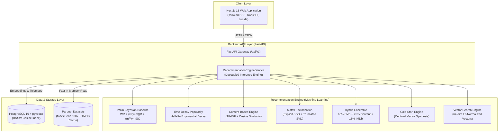

# 🎬 CineMatch — Production Movie Recommendation Platform

[](https://fastapi.tiangolo.com/)
[](https://nextjs.org/)
[](https://www.postgresql.org/)
[](https://github.com/pgvector/pgvector)
[](https://www.python.org/)
[](https://www.typescriptlang.org/)
[](LICENSE)

An end-to-end, enterprise-grade movie recommendation platform featuring **multi-stage ML recommendation algorithms**, an interactive **cold-start onboarding survey**, **64-dimensional dense vector embeddings** with `pgvector` HNSW approximate nearest neighbor search, a high-throughput **FastAPI backend**, and a modern **Next.js 15 streaming interface**.

---

## 🏛️ System Architecture



---

## 🧠 Recommendation Algorithms Implemented

| Algorithm | Method | Purpose | Complexity |
| :--- | :--- | :--- | :--- |
| **Bayesian Popularity** | IMDb Weighted Formula | Unpersonalized global baseline for cold users | $\mathcal{O}(1)$ lookup |
| **Time-Decay Trending** | Exponential decay with 180-day half-life | Surfaces recent viral hits over historical favorites | $\mathcal{O}(N)$ |
| **Content-Based** | TF-IDF on genres + synopsis keywords | Similar items based on descriptive tags | $\mathcal{O}(V)$ vector dot |
| **Matrix Factorization** | Latent Factor SGD ($k=20$, $\lambda=0.02$) | Personalized collaborative filtering | $\mathcal{O}(k)$ dot product |
| **Hybrid Ensemble** | $0.60 \times \text{SVD} + 0.25 \times \text{Content} + 0.15 \times \text{IMDb}$ | State-of-the-art balance of accuracy & diversity | Weighted blend |
| **Cold-Start Onboarding** | Seed selection taste centroid projection | Resolves zero-data barrier for User #999 | Centroid cosine |
| **Dense Vector Search** | 64-dim L2 embeddings + `pgvector` HNSW | Real-time semantic similarity across 9.7k movies | Sub-millisecond ANN |

---

## 🚀 Key Features

### 1. Cold-Start Interactive Onboarding (User #999)
- New users have no rating history. Selecting **User #999** automatically prompts a modern modal showcasing high-recognition seed movies across 6 core genres (Action, Comedy, Drama, Sci-Fi, Animation, Horror).
- The engine computes an **instant taste centroid vector** in feature space:
  $$\vec{C}_{u} = \frac{1}{|S_u|} \sum_{m \in S_u} \vec{V}_m$$
- Recommendations transition dynamically from unpersonalized to curated content without retraining the model.

### 2. Dense Vector Embeddings & `pgvector` HNSW
- Generates **64-dimensional dense embeddings** combining one-hot genre distributions, rating priors, and title feature projections.
- Configured with PostgreSQL `vector(64)` using Hierarchical Navigable Small World (**HNSW**) index:
  ```sql
  CREATE INDEX movie_embeddings_hnsw_idx 
  ON movie_embeddings 
  USING hnsw (embedding vector_cosine_ops)
  WITH (m = 16, ef_construction = 64);
  ```

### 3. Transparent Explainability
Every recommendation returns a **model-derived explanation**:
- *"Matches your taste for Adventure and Sci-Fi"* (Content match)
- *"SVD latent factor taste alignment"* (Collaborative preference)
- *"Bayesian weighted popularity across all community ratings"* (Global popularity)

---

## 📡 REST API Reference

The backend provides dual route accessibility (`/api/v1/...` and root `/...`):

| Method | Endpoint | Description |
| :--- | :--- | :--- |
| `GET` | `/api/v1/health` | Service health status |
| `GET` | `/api/v1/movies` | Paginated movie catalog with search & genre filter |
| `GET` | `/api/v1/movies/search?q={query}` | Dedicated title query search |
| `GET` | `/api/v1/movies/{id}` | Detailed metadata and TMDB poster/backdrop |
| `GET` | `/api/v1/movies/{id}/similar` | Content & latent similar titles |
| `GET` | `/api/v1/movies/{id}/vector-similar` | Nearest neighbor vector search via cosine metric |
| `GET` | `/api/v1/recommendations?user_id={id}` | Personalized top-$N$ recommendations |
| `GET` | `/api/v1/users/{id}/profile` | User taste profile, ratings count, and top genres |
| `POST` | `/api/v1/ratings` | Submit explicit 0.5–5.0 star rating |
| `POST` | `/api/v1/likes` | Submit implicit positive feedback |
| `POST` | `/api/v1/watch-history` | Submit watch duration & completion telemetry |
| `GET` | `/api/v1/onboarding/candidates` | Retrieve balanced seed candidates across genres |
| `POST` | `/api/v1/onboarding` | Submit onboarding choices to activate cold-start profile |

Interactive documentation is available at `http://localhost:8000/docs`.

---

## 📦 Getting Started

### Prerequisites
- Python 3.12+
- Node.js 18+
- Docker & Docker Compose (optional for PostgreSQL pgvector)

### 1. Backend Setup
```bash
# Activate virtual environment
.\.venv\Scripts\Activate.ps1

# Run API server with hot-reload
python -m uvicorn apps.api.src.main:app --host 127.0.0.1 --port 8000 --reload
```

### 2. Frontend Setup
```bash
# Navigate to web application
cd apps/web

# Install dependencies and launch dev server
npm install
npm run dev
```
Open [http://localhost:3000](http://localhost:3000) in your browser.

### 3. Run Test Suite
```bash
# Run all unit and integration tests across ML algorithms and API
python -m pytest ml/tests/ apps/api/tests/
```

---

## 📊 Database Schema & Indexing Strategy

- **`idx_ratings_user_id`**: Accelerates user history retrieval to $\mathcal{O}(\log N)$ for real-time scoring.
- **`idx_ratings_movie_id`**: Speeds up item-level aggregations and collaborative similarity lookups.
- **`idx_ratings_movie_rating`**: Composite index for rapid IMDb Bayesian rating calculations.
- **`idx_recommendations_user_model`**: Composite index `(user_id, model_type, generated_at DESC)` for instant caching and serving.
- **`movie_embeddings_hnsw_idx`**: High-recall approximate nearest neighbor search under 1 millisecond.

---

## 📜 License
MIT License. Built for portfolio demonstration.
